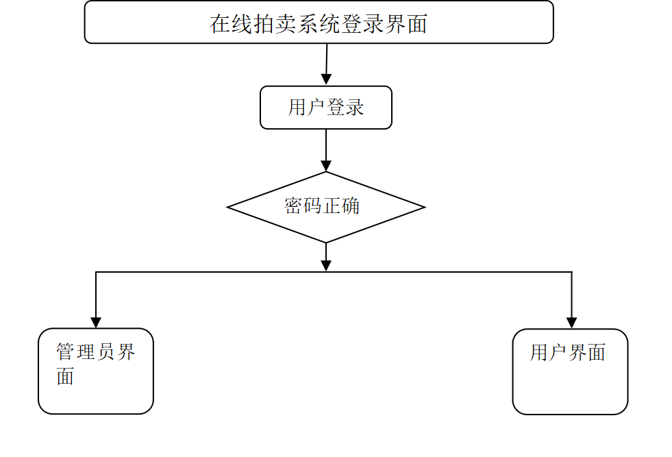
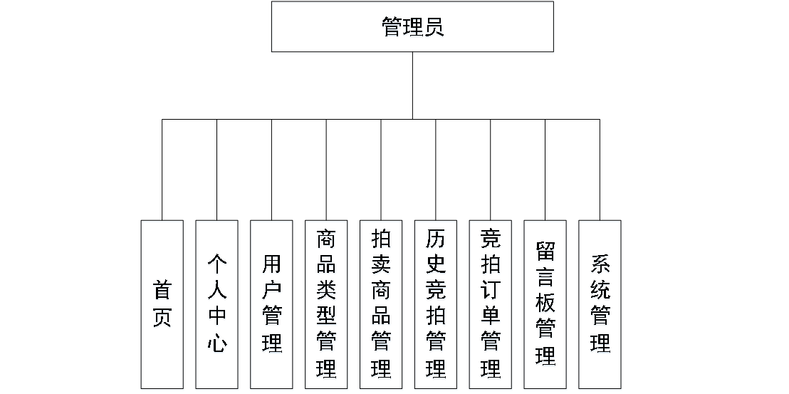
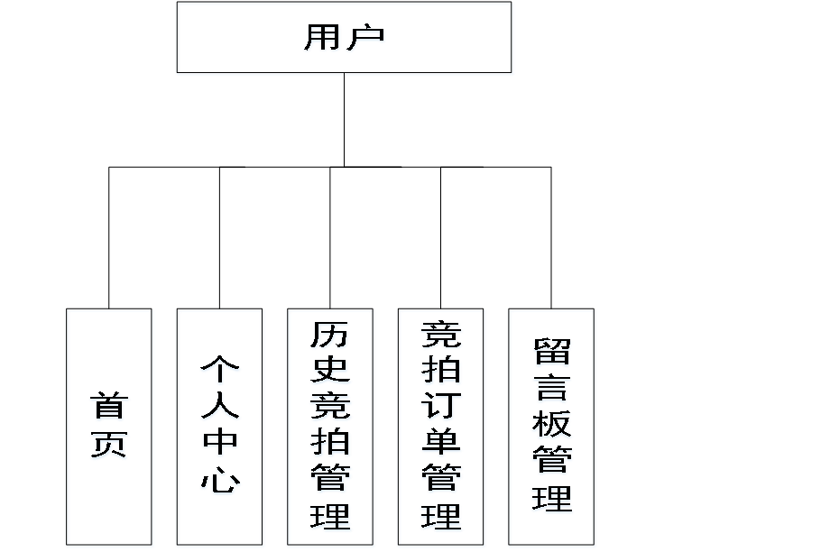
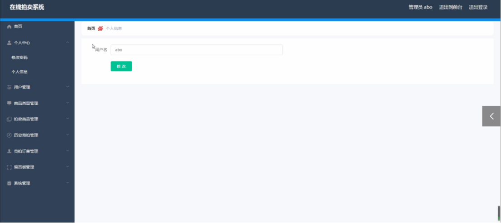
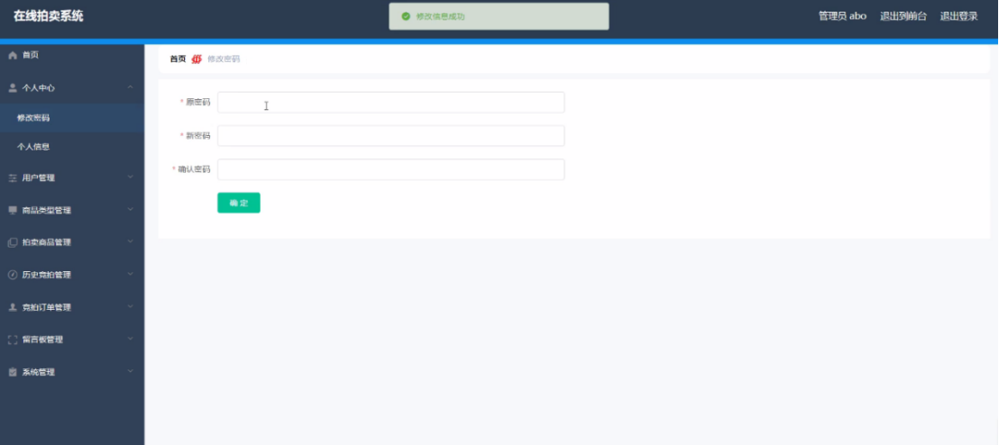
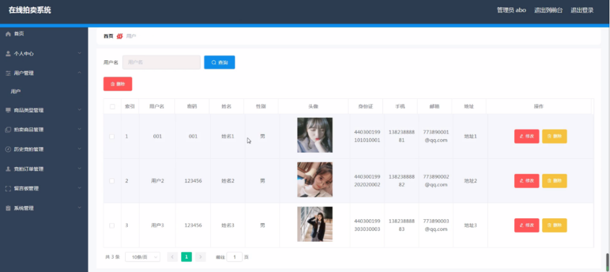
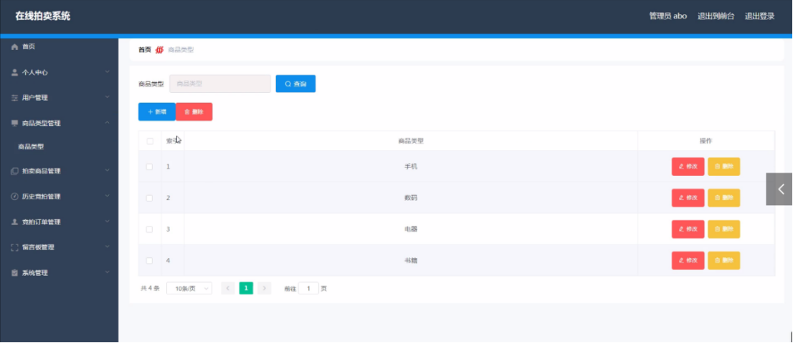
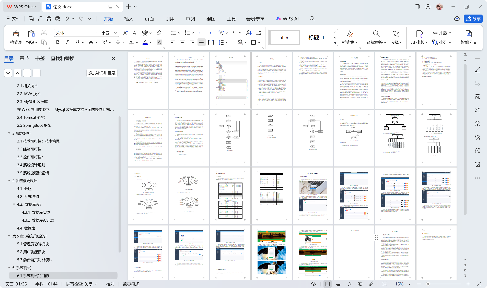

# springboot001-基于SpringBoot的在线拍卖系统

>  博主介绍：
>  Hey，我是程序员Chaers，一个专注于计算机领域的程序员
>  十年大厂程序员全栈开发‍ 日常分享项目经验 解决技术难题与技术推荐 承接各类网站设计，小程序开发，毕设等。
>  【计算机专业课程设计，毕业设计项目，Java，微信小程序，安卓APP都可以做，不仅仅是计算机专业，其它专业都可以】

## 本项目获取地址：https://www.bishecode.com/product/2/

## 3000套系统可挑选，获取链接：https://www.bishecode.com/

### 系统架构

> 前端：html | js | css | jquery | vue
>
> 后端：springboot | mybatis
> 
> 环境：jdk1.8+ | mysql | maven

# 一、内容包括
包括有  项目源码+项目论文+数据库源码+答辩ppt+远程调试成功

# 二、需求分析

**2.1技术可行性：技术背景**   
在线拍卖系统是在Windows操作系统中进行开发运用的，而且目前PC机的各项性能已经可以胜任普通网站的web服务器。系统开发所使用的技术也都是自身所具有的，也是当下广泛应用的技术之一。
系统的开发环境和配置都是可以自行安装的，系统使用Java开发工具，使用比较成熟的Mysql数据库进行对系统前台及后台的数据交互，根据技术语言对数据库，结合需求进行修改维护，可以使得网站运行更具有稳定性和安全性，从而完成实现网站的开发。

（1）硬件可行性分析
系统管理及信息分析的设计对于所使用的计算机没有什么硬性的要求，计算机只要可以正常的使用进行代码的编写及页面设计就可行，主要是对于服务器有些要求，对于平台搭建完成要上传的服务器是有一定的要求的，服务器必须选择安全性比较高的，然后就是在打开网站必须顺畅，不能停顿太长时间；性价比高；安全性高。

（2）软件可行性分析
开发整个系统使用的是云计算，流量的可扩展性和基于流量的智能调整云计算的优点就是流量的可扩展性和基于流量的智能调整，保障了数据信息能够得到及时的备份，整个系统可以安全有效的运行。 
因此，我们从两个方面进行了可行性研究，可以看出系统的开发没有问题。

**2.2经济可行性**

在在线拍卖系统开发之前所做的市场调研及与其相关的其他管理系统，都是没有任何费用的。所有的调查研究都是通过开发者自己的努力，所有的工作也都是自己亲力亲为的。在碰到自己比较难以解决的问题时，大多数是通过指导老师和同学的帮助进行相关问题的解决。所以对于在线拍卖系统的开发在经济上是完全可行的，没有任何费用支出的。 
使用比较成熟的技术，系统是基于Java的开发，采用Mysql数据库。所以系统在开发人力、财力方面的要求不高，具有经济可行性。

**2.3操作可行性**

可操作性主要是对在在线拍卖系统设计完成后，用户的使用体验度，以及管理员可以通过系统随时管理相关的数据信息，并且对于管理员、用户二个权限角色，都可以简单明了的进入到自己的系统界面，通过界面可以简单明了地操作功能模块，方便用户信息的操作需求和管理员管理数据信息。对于系统的操作，不需要专业人员都可以直接进行功能模块的操作管理，所以在线拍卖系统的可操作性是完全可以的。本系统的操作使用的也是界面窗口进行登录，所以操作人员只要会简单的电脑操作就完全可以的。

**2.4系统设计规则**

本在线拍卖系统采用Java技术，Mysql数据库开发，充分保证了系统稳定性、完整性。 
在线拍卖系统的设计与实现的设计思想如下： 
1、操作简单方便、系统界面安全良好：简单明了的页面布局，方便查询管理的相关信息。
2、即时可见：对在线拍卖系统信息的处理将立马在对应地点可以查询到，从而实现“即时发布、即时见效”的系统功能。 
3、功能的完善性：管理员；首页、个人中心、用户管理、商品类型管理、拍卖商品管理、历史竞拍管理、竞拍订单管理、留言板管理、系统管理，用户；首页、个人中心、历史竞拍管理、竞拍订单管理、留言板管理，前台首页；首页、拍卖商品、竞拍公告、留言反馈、个人中心、后台管理模块的修改和维护操作。

**2.5系统流程和逻辑**

系统业务流程图，如图所示：

# 三、运行环境

> jdk版本：1.8 及以上； ide工具：IDEA； 数据库: mysql5.7及以上；编程语言: Java

# 四、功能模块

# 五、部分效果图展示
图5-1管理员登录界面图

图5-2管理员功能界面图

图5-3修改密码界面图

图5-4用户管理界面图

图5-5前台首页功能界面图

 <b>完整文章</b>

## 本项目获取地址：https://www.bishecode.com/product/2/

## 3000套系统可挑选，获取链接：https://www.bishecode.com/

